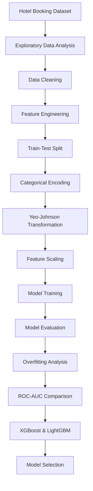
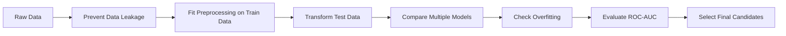

# 🏨 Hotel Booking Cancellation Prediction

[](https://www.kaggle.com/code/onursvm/hotel-booking-cancellation-prediction)


## 📌 Project Overview

This project presents an end-to-end machine learning workflow for predicting whether a hotel reservation will be canceled.

The project includes exploratory data analysis, data cleaning, feature engineering, categorical encoding, numerical transformations, classification model comparison, overfitting analysis, ROC-AUC evaluation, and automated model benchmarking.

The main objective is to identify reservations with a high probability of cancellation while building a model that generalizes well to unseen data.

---

## 🔄 Machine Learning Workflow



---

## 📊 Dataset

The dataset contains hotel reservation information including booking behavior, guest information, stay details, room information, pricing, and reservation characteristics.

Some of the main features include:

- Lead time
- Arrival date
- Weekend and weekday stays
- Number of adults, children, and babies
- Meal type
- Market segment
- Distribution channel
- Previous cancellations
- Previous successful bookings
- Room type
- Deposit type
- Average Daily Rate (ADR)
- Parking requirements
- Special requests
- Agent and company information

### Target Variable

The target variable is:

`is_canceled`

| Value | Description |
|---|---|
| `0` | Reservation was not canceled |
| `1` | Reservation was canceled |

---

## 🔍 Exploratory Data Analysis

Exploratory Data Analysis was performed to understand the structure and characteristics of the dataset before model development.

The analysis included:

- Dataset shape and data types
- Descriptive statistics
- Missing value analysis
- Duplicate analysis
- Target class distribution
- Numerical feature distributions
- Categorical feature distributions
- ADR analysis
- Outlier investigation
- Feature relationships and correlation analysis

Special attention was given to unusual ADR values. Zero ADR observations were investigated and retained because they could represent valid reservations, while an invalid negative ADR observation was removed.

---

## 🧹 Data Cleaning

Data cleaning decisions were made carefully to avoid unnecessarily removing valid observations.

Instead of automatically removing every statistical outlier, suspicious values were investigated individually.

Features that could introduce target leakage or provide information unavailable at the intended prediction stage were also investigated and excluded where appropriate.

High-cardinality and redundant features were evaluated before model training.

---

## 🛠️ Feature Engineering

New features were created from reservation information to preserve useful signals while simplifying the dataset.

Two binary features were created from agent and company information:

- `has_agent`
- `has_company`

These features indicate whether a reservation was associated with an agent or a company without relying directly on their original identifiers.

---

## 🔤 Categorical Feature Encoding

Different encoding strategies were selected according to the characteristics of the categorical variables.

### One-Hot Encoding

Nominal categorical variables were transformed using `OneHotEncoder`.

This approach was used for features where categories do not have a meaningful numerical order, such as:

- Arrival month
- Market segment
- Distribution channel
- Reserved room type
- Deposit type
- Customer type
- City

Unknown categories were handled during transformation to prevent errors when unseen values appear in the test data.

### Ordinal Encoding

Meal categories were encoded according to meal-package coverage:

| Meal | Encoded Value |
|---|---:|
| SC | 0 |
| BB | 1 |
| HB | 2 |
| FB | 3 |

Undefined meal observations were handled together with the no-meal/self-catering category during preprocessing.

---

## ✂️ Train-Test Split

The dataset was separated into training and test sets before learned preprocessing operations.

This ensures that statistical information from the test set is not used while fitting preprocessing transformations.

The training data was used to learn preprocessing parameters, and the same fitted transformations were then applied to the test data.

This approach helps prevent **data leakage**.

---

## 📐 Numerical Feature Transformation

Numerical features were transformed using the **Yeo-Johnson Power Transformation**.

Yeo-Johnson was selected because it can handle zero and negative values while reducing skewness in numerical distributions.

The transformer was fitted only on the training data and subsequently applied to the test data.

Numerical features were also standardized to provide comparable feature scales for algorithms that are sensitive to feature magnitude.

Binary and one-hot encoded variables were kept separate from numerical transformations.

---

## 🤖 Classification Models

Several machine learning classification algorithms were trained and evaluated to establish baseline performance.

The evaluated models included:

- Logistic Regression
- K-Nearest Neighbors
- Decision Tree
- Random Forest
- AdaBoost
- Gradient Boosting
- XGBoost
- LightGBM

Using models from different algorithm families made it possible to compare linear, distance-based, tree-based, bagging, and boosting approaches.

---

## 📏 Evaluation Metrics

Model performance was evaluated using multiple classification metrics rather than relying only on accuracy.

The evaluation included:

- Accuracy
- Precision
- Recall
- F1-Score
- Confusion Matrix
- ROC Curve
- ROC-AUC Score

Because the objective is to identify canceled reservations, the performance of the positive cancellation class (`1`) was also considered during model comparison.

---

## ⚠️ Overfitting Analysis

Training and test performance were compared to identify models that learned the training data too closely.

Random Forest and Decision Tree achieved extremely high training performance but showed noticeably lower performance on unseen test data.

This indicated substantial overfitting with their default configurations.

Boosting-based models provided a better balance between predictive performance and generalization.

---

## 🏆 Best Performing Models

After comparing the baseline models, **XGBoost** and **LightGBM** were selected as the strongest candidates.

| Model | Train Accuracy | Test Accuracy | Cancellation F1 | ROC-AUC |
|---|---:|---:|---:|---:|
| **XGBoost** | 0.8507 | **0.8332** | **0.75** | **0.9002** |
| **LightGBM** | 0.8380 | 0.8319 | 0.74 | 0.8973 |

XGBoost achieved the highest ROC-AUC and slightly higher test accuracy.

LightGBM achieved very similar test performance while showing a smaller difference between training and test accuracy.

---

## 📈 ROC-AUC Analysis

ROC-AUC was used to evaluate how effectively each model separates canceled and non-canceled reservations across different classification thresholds.

The two strongest models achieved:

```text
XGBoost  : ROC-AUC = 0.9002
LightGBM : ROC-AUC = 0.8973
```

Both models demonstrated strong discriminatory ability, with XGBoost achieving the highest ROC-AUC score.

---

## 🧪 LazyClassifier Benchmarking

LazyClassifier was used as an additional automated benchmarking approach.

Because running a large collection of algorithms on the complete dataset can be computationally expensive, representative subsets of the training and test sets were used for this comparison.

LazyClassifier provided a quick overview of how different classification algorithms perform under the same processed dataset.

This benchmark was used as a supplementary analysis rather than as a replacement for the manually evaluated models.

---

## 🧠 Key Machine Learning Considerations

Several important machine learning practices were considered throughout the project:



The project emphasizes not only achieving high predictive performance but also maintaining a reliable evaluation process and good generalization to unseen observations.

---

## 🧰 Technologies & Libraries

- Python
- Pandas
- NumPy
- Matplotlib
- Seaborn
- Scikit-learn
- XGBoost
- LightGBM
- LazyPredict
- Jupyter Notebook

---

## 📁 Project Structure

```text
hotel-booking-cancellation-prediction/
│
├── hotel_booking_cancellation_prediction.ipynb
└── README.md
```

---

## 🎯 Key Takeaways

This project demonstrates a complete machine learning classification workflow, including:

- Exploratory Data Analysis
- Data cleaning and outlier investigation
- Feature engineering
- Data leakage prevention
- One-Hot and Ordinal Encoding
- Yeo-Johnson transformation
- Feature scaling
- Multiple classification algorithms
- Train-test performance comparison
- Overfitting analysis
- Confusion matrix evaluation
- ROC-AUC analysis
- XGBoost and LightGBM comparison
- Automated model benchmarking with LazyClassifier

The results demonstrate that gradient boosting methods are particularly effective for this hotel booking cancellation prediction problem.

Among the evaluated baseline models, **XGBoost achieved the strongest overall predictive performance**, while **LightGBM provided highly competitive results with strong generalization**.

---

## 👤 Author

**Onur Sevim**

Machine Learning & Data Science Project
